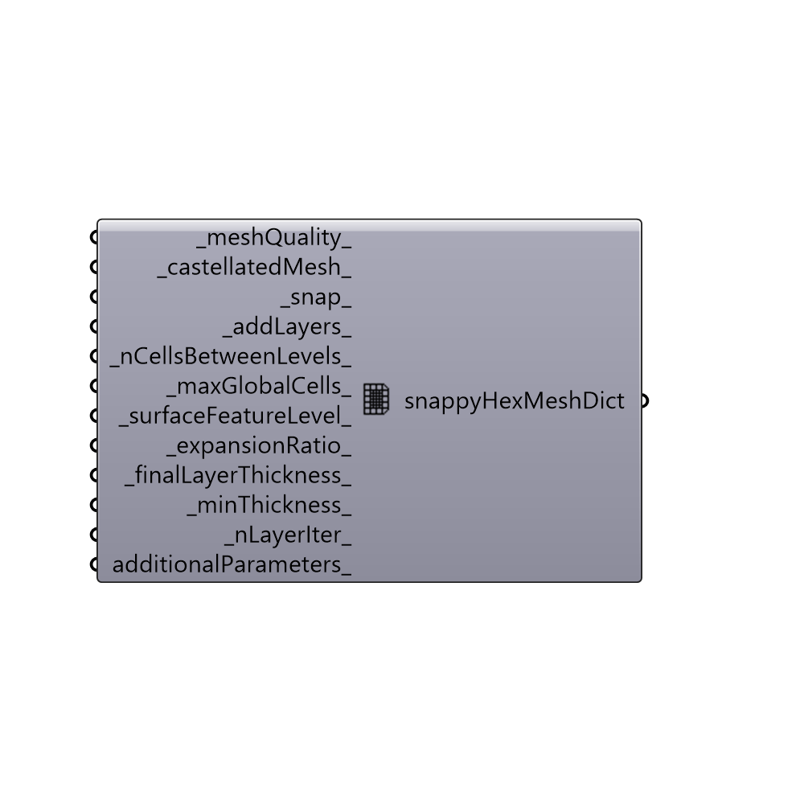

##  snappyHexMeshDict

Set parameters for snappyHexMeshDict.
 Read more about snappyHexMeshDict here:
     https://openfoamwiki.net/images/f/f0/Final-AndrewJacksonSlidesOFW7.pdf

#### Inputs
* ##### meshQuality [Default]
Use 0-2 to auto generate the parameters for meshQualityControls
* ##### castellatedMesh [Default]
Set to True to castellated mesh (default: True).
* ##### snap [Default]
Set to True to snap mesh to the surfaces (default: True).
* ##### addLayers [Default]
Set to True to push mesh away from surfaces and add layers (default: False).
* ##### nCellsBetweenLevels [Default]
Script variable snappyHexMeshDict
* ##### maxGlobalCells [Default]
An intger for the maximum number of global cells (default: 2000000).
* ##### surfaceFeatureLevel [Default]
An integer for the extract features refinement. Default is None which
 means implicit meshing feature will be used.
* ##### expansionRatio [Default]
Layers expansion ration (default: 1.1)
* ##### finalLayerThickness [Default]
Thickness of final layer (default: 0.7)
* ##### minThickness [Default]
Minimum thickness for layers (default: 0.1).
* ##### nLayerIter [Default]
Overall max number of layer addition iterations. The mesher
 will exit if it reaches this number of iterations; possibly with an
 illegal mesh (default: 50).
* ##### additionalParameters [Optional]
Additional parameters as a valid c++ dictionary. Additional values
 will overwrite the values from the other inputs above.

#### Outputs
* ##### snappyHexMeshDict
Butterfly snappyHexMeshDict.

[Check Hydra Example Files for snappyHexMeshDict](https://hydrashare.github.io/hydra/index.html?keywords=Butterfly_snappyHexMeshDict)