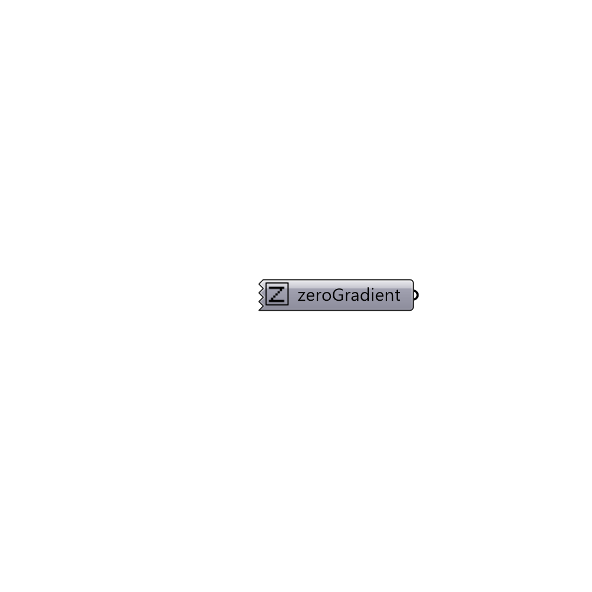

##  zeroGradient

zeroGradient boundary condition.
 -

#### Inputs

#### Outputs
* ##### zeroGradient
zeroGradient boundary condition.

[Check Hydra Example Files for zeroGradient](https://hydrashare.github.io/hydra/index.html?keywords=Butterfly_zeroGradient)